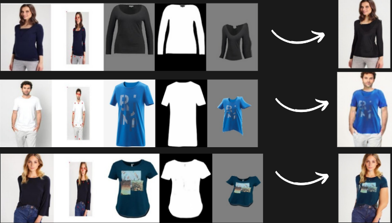
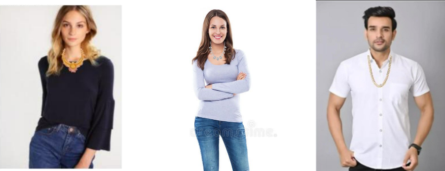
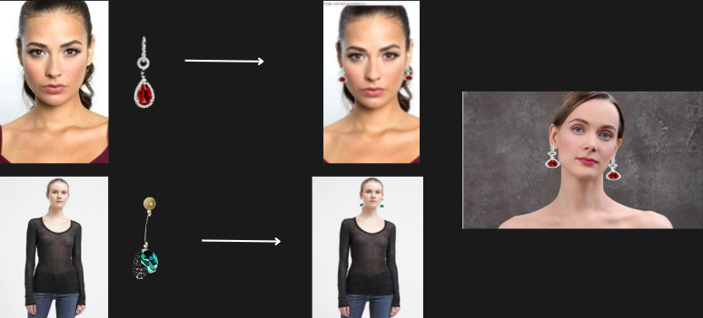
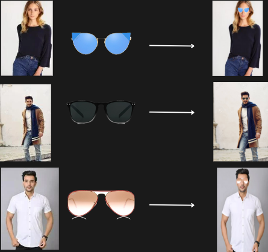
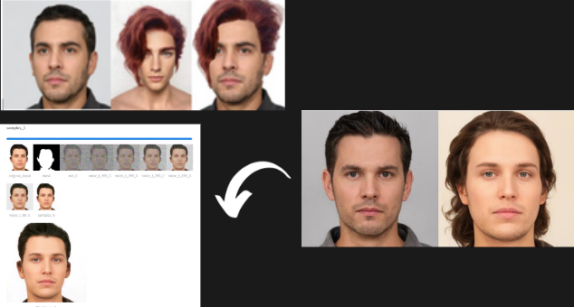
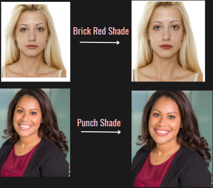
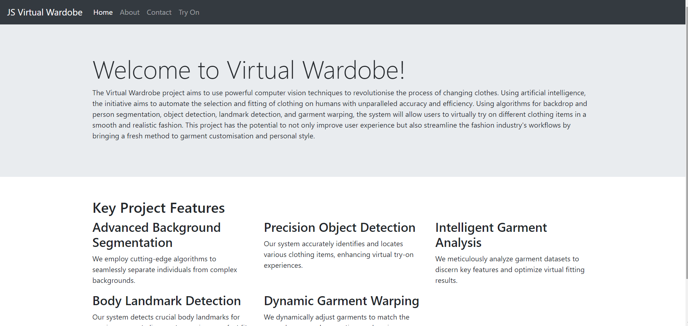
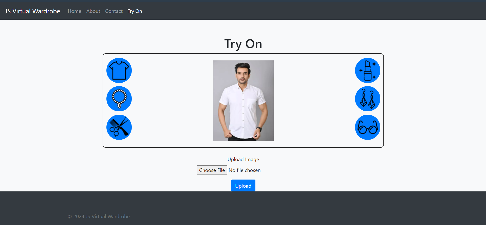
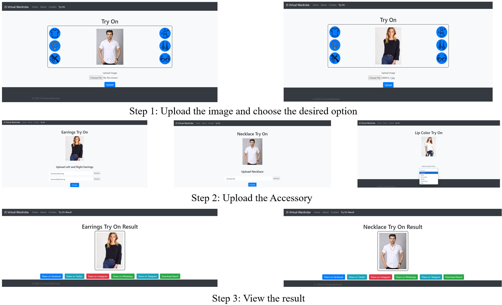

# AI-Virtual Wardrobe

## Overview
The AI-Virtual Wardrobe project leverages computer vision techniques and artificial intelligence to transform the process of trying on clothes and accessories. This project aims to enhance and automate the virtual try-on experience, providing users with a realistic and interactive way to explore their personal style and customize their wardrobe.

## Objectives
- **High Accuracy Garment Detection and Segmentation:** Achieve precise identification and segmentation of clothing items.
- **Accessory Placement:** Accurately position accessories such as necklaces, earrings, lipstick, hair wigs, and glasses.
- **Intuitive Interface:** Develop a user-friendly interface for seamless interaction.
- **Posture Estimation:** Utilize posture estimation to adjust clothing items to fit the wearer’s body accurately.

## Features
- **Comprehensive Virtual Try-On Experience:** Extends beyond clothing to include a variety of accessories.
- **Image Preprocessing:** Efficient preprocessing of images to prepare for further analysis.
- **Object and Position Identification:** Accurate identification of objects and their positions within images.
- **Garment and Accessory Warping:** Seamless adjustment of garments and accessories to fit the user's body and facial features.
- **User-Friendly Web Application:** Integrates all elements into a cohesive and easy-to-use web application.

## Impact
The AI-Virtual Wardrobe project marks a significant advancement in personal style exploration and clothing customization. By enhancing user experience and streamlining workflows, this project has the potential to transform the fashion industry.

## How to Use
1. **Upload Image:** Start by uploading an image of yourself or a predefined model image.
2. **Select Try-On Feature:** Choose the desired try-on feature from the available options.
3. **Upload Accessory:** Depending on the selected feature, upload the necessary accessory.
4. **View and Share Results:** View the final result, with options to download or share it on social media.

## Results
**Cloth Try On Output**

**Necklace Try On Output**

**Earrings Try On Output**

**Glasses Try On Output**

**Hairwig Try On Output**

**Lipstick Try On Output**

**Web App Interface**

## Conclusion
The AI-Virtual Wardrobe project showcases the transformative power of computer vision and AI in the fashion industry. By providing a comprehensive and interactive virtual try-on experience, it helps users visualize clothing and accessories with accuracy, ultimately enhancing their shopping experience and personal style exploration.
